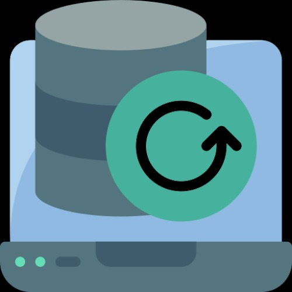

# LibreELEC Backupper

<div align="center">



*Your reliable backup solution for LibreELEC*

[](LICENSE)
[](service.libreelec.backupper/addon.xml)
[](https://libreelec.tv/)

</div>

## 🎯 What's New in 1.1.0 (March 13, 2025)

We're excited to announce a major update focused on improving user experience and reliability:

- **Beautiful New UI** with enhanced notifications and progress reporting
- **Real-time File Size Display** in notifications with addon icon
- **Improved Progress Tracking** during backup/restore operations
- **Reliable Background Service** for scheduled backups
- **Test Connection Feature** to verify your remote storage settings
- **Separated Service Architecture** for better stability

## 🚀 Key Features

- **Flexible Storage Options**
  - Local storage backup
  - SMB (Windows shares)
  - NFS support
  - FTP/SFTP support
  - WebDAV compatibility

- **Smart Backup Management**
  - Configurable schedules
  - Adjustable compression
  - Retention policies
  - One-click restore

## 📋 System Requirements

- LibreELEC 10.0+
- Kodi 19 (Matrix) or newer
- Available storage space

## 🔧 Quick Start

1. **Install the Addon**
   ```
   Add-ons > Install from repository > LibreELEC Backupper
   ```

2. **Configure Settings**
   - Set backup location
   - Configure schedule
   - Adjust compression
   - Set retention policy

3. **Start Backing Up**
   - Click the addon to open
   - Choose "Make Backup"
   - Watch the progress
   - Done!

## 📚 Documentation

### Creating Backups

1. Open LibreELEC Backupper
2. Select "Make Backup"
3. Watch the progress indicator
4. Receive completion notification with size

### Restoring Backups

1. Open LibreELEC Backupper
2. Select "Restore Backup"
3. Choose your backup
4. Confirm and wait
5. Restart when prompted

## 🚧 Upcoming Features (NOT TESTED)

> **Important Note:** The following features are still in development and have **NOT BEEN TESTED**. They are planned for future releases but are not currently available:

### System & Network
- **FSTAB Support** - Mount points configuration backup
- **Bootloader Settings** - System boot configuration
- **Network Configuration**
  - WiFi Configuration
  - Hosts File
  - Samba Settings
  - VPN Configuration
  - SSH Configuration

### Media & User Data
- **Media Management**
  - Playlists
  - Thumbnails/Fanart
  - Media Database
- **User Preferences**
  - User Profiles
  - Game Saves
  - Skins
  - Favourites
  - Keyboard Mappings

### Security
- **Security Features**
  - Password Management
  - Certificates Backup
  - SSH Keys
  - Backup Encryption

### Advanced Features
- **System Maintenance**
  - System Logs
  - Crash Logs
  - Temporary Files Management
- **Custom Content**
  - Custom Scripts
  - Custom Configurations
- **Enhanced Notifications**
  - Alternative Notification Methods
  - Email Notifications

### Previously Listed Features
- **Differential Backups** - Only backup changed files
- **Cloud Storage** - Google Drive/Dropbox integration
- **Remote Management** - Web/mobile control
- **Multi-system Support** - Manage multiple devices
- **Backup Verification** - Integrity checking

## 🔍 Troubleshooting

Common solutions for:
- Connection issues
- Space problems
- Permission errors
- Schedule conflicts

Need more help? Check our [Forum](https://forum.libreelec.tv/) or [GitHub Issues](https://github.com/Nigel1992/service.libreelec.backupper/issues).

## 🤝 Contributing

We welcome contributions! Here's how:

1. Fork the repo
2. Create your feature branch
3. Commit changes
4. Push to your branch
5. Open a Pull Request

## 📜 License

GPL-2.0 License - see [LICENSE](LICENSE)

## 📬 Contact & Support

- **Author:** Nigel1992
- **GitHub:** [Nigel1992](https://github.com/Nigel1992)
- **Project:** [service.libreelec.backupper](https://github.com/Nigel1992/service.libreelec.backupper)

---

<div align="center">
  <b>Protect Your LibreELEC System Today!</b><br>
  <i>Simple, Reliable, Automated Backups</i>
</div>
